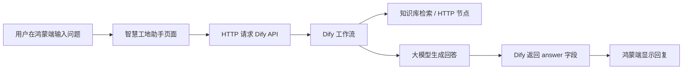
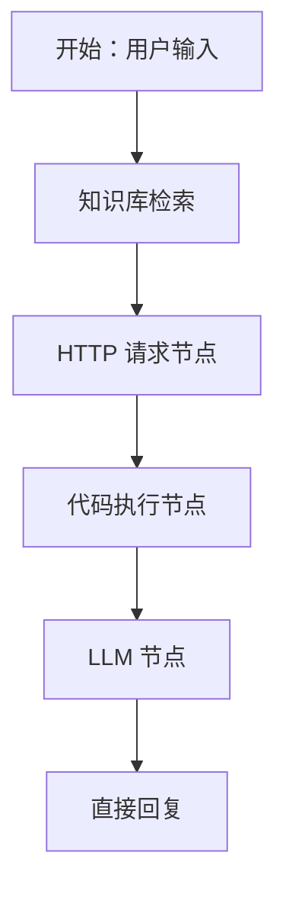

# 智慧工地系统中大模型技术的使用说明

## 1. 项目背景

本项目为“智慧工地”应用系统，面向施工现场管理场景，主要包含工人打卡、管理员看板、材料区温湿度监测、华为云 IoTDA 设备接入、视频监控、金仓数据库历史数据存储、数字孪生展示等功能。

为了提高系统的人机交互能力和问题处理效率，本项目引入了大模型技术，构建“智慧工地助手”。该助手可以在工人端和管理员端通过悬浮按钮进入，对系统中的打卡、材料监测、视频接入、数字孪生、项目运维等问题进行自然语言问答。

## 2. 大模型技术的总体作用

本系统中大模型不是单独作为聊天工具存在，而是作为智慧工地系统的智能交互层，主要承担以下作用：

1. 提供自然语言问答能力，降低用户理解系统功能的门槛。
2. 辅助管理员查询系统状态，例如打卡任务、材料区状态、监控接入情况。
3. 对材料区温湿度、风扇、告警等数据进行解释，帮助用户理解当前是否存在异常。
4. 结合知识库文档，对项目功能、操作步骤、故障排查流程进行回答。
5. 为后续扩展智能预警、运维建议、施工安全分析提供基础。

## 3. 系统中使用的大模型相关组件

本项目的大模型功能主要由以下几个部分组成：

### 3.1 Ollama 本地模型服务

Ollama 用于在本地运行大语言模型，例如 DeepSeek 系列模型。它负责真正执行文本理解和回答生成。

在本系统中，Ollama 的作用是：

- 提供本地推理能力。
- 减少对外部商业大模型接口的依赖。
- 便于在演示环境中离线或半离线运行。
- 方便后期替换不同参数规模的大模型。

常见启动方式：

```powershell
ollama serve
```

模型示例：

```powershell
ollama pull deepseek-r1:7b
```

### 3.2 Dify 智能体编排平台

Dify 负责把大模型能力包装成可调用的应用接口。系统不是直接在鸿蒙端调用 Ollama，而是通过 Dify 进行统一编排。

Dify 在本项目中的作用包括：

- 管理大模型应用。
- 配置系统提示词和角色定位。
- 接入知识库文档。
- 编排 HTTP 请求节点、知识检索节点、LLM 节点和直接回复节点。
- 对外提供统一的聊天接口。

鸿蒙端调用 Dify 的接口地址通常为：

```text
http://localhost/v1/chat-messages
```

如果手机或模拟器访问，需要根据实际网络环境改为电脑局域网 IP 或内网穿透地址。

### 3.3 鸿蒙端智慧工地助手

鸿蒙应用中设计了一个悬浮 AI 按钮，工人端和管理员端都可以进入“智慧工地助手”页面。

用户在助手页面输入问题后，鸿蒙端通过 HTTP 请求把问题发送给 Dify，Dify 调用大模型生成回答，再把结果返回给鸿蒙端显示。

调用流程如下：



## 4. 大模型在系统中的具体应用场景

### 4.1 打卡系统问答

用户可以询问：

- 今天有没有打卡任务。
- 如何签到、签退。
- 工时为什么没有变化。
- 管理员如何发布打卡任务。
- 管理员如何查看工人打卡记录。

大模型可以根据系统设计说明和知识库内容进行解释，帮助工人和管理员理解打卡逻辑。

### 4.2 材料区监测解释

材料区包含水泥区、木材区等不同存储区域，不同材料的环境要求不同。

大模型可以辅助解释：

- 当前温度是否正常。
- 当前湿度是否超过阈值。
- 风扇为什么自动开启或关闭。
- 告警状态代表什么。
- 材料历史趋势图应该如何理解。

例如，当水泥区湿度偏高时，助手可以说明湿度过高可能影响水泥存储质量，并提示管理员检查通风、除湿或风扇策略。

### 4.3 华为云 IoTDA 设备接入说明

系统中接入了华为云 IoTDA，用于读取设备影子和下发控制命令。

大模型可回答：

- Token 失效后应该如何处理。
- 设备影子是什么。
- 为什么命令下发成功但设备状态没有变化。
- service_id、command_name、paras 分别代表什么。
- 为什么华为云消息跟踪显示已下发，但 APP 中仍未显示 ON。

这类问题对初学者比较复杂，大模型可以把云端、设备端、APP 端的关系解释清楚。

### 4.4 视频监控与 RTSP 接入说明

系统中包含本地摄像头和 RTSP 视频流接入。大模型可辅助说明：

- 摄像头 IP 如何配置。
- RTSP 地址如何填写。
- 为什么视频一直加载。
- 本地地址 127.0.0.1 为什么手机无法访问。
- 云服务器推流和播放地址之间的区别。

### 4.5 数字孪生功能说明

系统使用 THINGJS 展示数字孪生场景，将材料区、传感器、风扇、灯光、告警状态等与实际数据进行关联。

大模型可以帮助解释：

- 数字孪生是什么。
- 为什么材料区可以使用数字孪生。
- THINGJS 场景中的设备与真实设备如何对应。
- 温湿度数据如何影响场景颜色、状态标签或设备动画。

## 5. Dify 工作流设计

本项目中的 Dify 应用可以采用以下工作流结构：



各节点作用如下：

- 用户输入：接收鸿蒙端传来的问题。
- 知识库检索：查询项目说明文档、操作说明、接口说明等资料。
- HTTP 请求节点：访问 Supabase、金仓材料 API 或其他业务接口。
- 代码执行节点：对 HTTP 返回结果进行整理，提取关键字段。
- LLM 节点：根据用户问题、知识库内容和接口数据生成自然语言回答。
- 直接回复：把最终 answer 返回给鸿蒙端。

## 6. 鸿蒙端调用方式

鸿蒙端通过 HTTP 请求调用 Dify 的聊天接口。请求体中主要包含以下字段：

```json
{
  "inputs": {},
  "query": "用户输入的问题",
  "response_mode": "blocking",
  "conversation_id": "",
  "user": "devstudio-user"
}
```

请求头中需要包含：

```text
Authorization: Bearer app-你的API密钥
Content-Type: application/json
```

Dify 返回结果后，鸿蒙端主要读取：

```text
answer
```

并显示在智慧工地助手页面中。

## 7. 大模型角色定位

本系统中的大模型被设计为“智慧工地助手”，其角色定位如下：

```text
你是智慧工地项目的智能助手，服务对象包括工人和管理员。
你需要用简洁、准确、易懂的语言回答问题。
你熟悉本系统的打卡签到、材料监测、华为云 IoTDA、金仓数据库、视频监控和数字孪生功能。
当用户询问设备状态、材料区数据、打卡记录时，应优先结合系统接口返回的数据进行回答。
如果接口没有返回数据，应明确说明当前没有查询到数据，不要编造。
当用户询问故障原因时，应按“可能原因、排查步骤、建议处理”进行说明。
```

## 8. 数据真实性与安全边界

本项目明确要求数据不能作假，因此大模型只负责解释和组织语言，不负责伪造数据。

系统遵循以下原则：

- 华为云设备数据以 IoTDA 设备影子为准。
- 材料历史数据以金仓数据库记录为准。
- 打卡数据以 Supabase 云数据库为准。
- 大模型回答业务数据时，应基于接口返回结果。
- 当接口不可用或无数据时，应提示“暂无数据”或“接口连接失败”。
- Token、API Key 等敏感信息不应在回答中完整暴露。

## 9. 技术优势

引入大模型后，系统具有以下优势：

1. 交互方式更自然，用户可以直接提问。
2. 系统说明和故障排查更清晰，降低使用难度。
3. 管理员可以快速理解材料区、打卡、监控等模块状态。
4. 便于将多个模块的信息整合成统一回答。
5. 为后续智能预警和辅助决策提供扩展基础。

## 10. 总结

本项目通过 Ollama、Dify 和鸿蒙端 HTTP 调用，将大模型能力集成到智慧工地系统中。大模型主要用于自然语言问答、业务功能解释、设备状态分析、材料监测说明和故障排查辅助。

在整体架构中，大模型不是替代传感器、数据库或云平台，而是作为系统的智能交互层，将华为云 IoTDA、金仓数据库、Supabase、视频监控和数字孪生等功能连接起来，使用户能够更方便地理解和使用系统。
